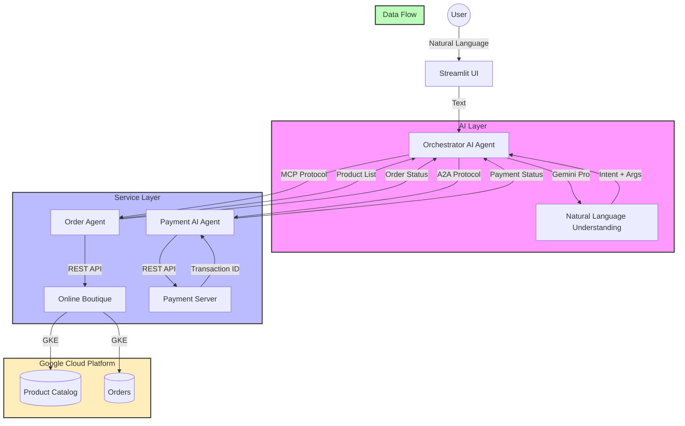

# TransactAI: Natural Language E-commerce with AI Agents 🛍️

A Google Cloud GKE Turns 10 Hackathon project that enables natural language product ordering using AI agents and Google's Online Boutique.

## 🌟 Features

- Natural language product ordering (e.g., "order 2 sunglasses")
- AI-powered order processing with Gemini Pro
- Integration with Google's Online Boutique e-commerce demo
- Agent-to-Agent (A2A) communication for payment processing
- Model Context Protocol (MCP) for service discovery
- Real-time order tracking and payment processing
- Beautiful Streamlit UI

## 🛠️ Architecture



### Component Details

- **Orchestrator AI Agent**: 
  - Built with Streamlit and Gemini Pro
  - Coordinates all services
  - Handles natural language processing
  - Manages user interactions

- **Order Agent (MCP Protocol)**:
  - Implements Model Context Protocol
  - Manages product catalog
  - Handles order placement
  - Integrates with Online Boutique

- **Payment AI Agent (A2A Protocol)**:
  - Implements Agent-to-Agent Protocol
  - Processes payment requests
  - Validates transaction details
  - Communicates with Payment Server

- **Payment Server**:
  - Simulates payment gateway
  - Generates transaction IDs
  - Validates payment details
  - Returns payment status

- **Online Boutique**:
  - Google's microservices demo
  - Runs on GKE
  - Manages product catalog
  - Handles order processing

## 🚀 Getting Started

This guide will help you set up and run TransactAI on your local machine.

### Prerequisites

1. Python 3.10 or higher
2. Google Cloud account with:
   - Billing enabled
   - Gemini API access
   - A project with required APIs enabled
3. Google Cloud SDK
4. kubectl
5. Git

### Step-by-Step Setup Guide

#### 1. Clone and Setup Environment

```bash
# Clone the repository
git clone https://github.com/avaneendra/transact_ai.git
cd transact_ai

# Create and activate virtual environment
python -m venv triage_env
source triage_env/bin/activate  # On Windows: triage_env\Scripts\activate

# Install dependencies
pip install -r requirements.txt
```

#### 2. Set Up Google Cloud

1. Install Google Cloud SDK:
   - macOS: `brew install google-cloud-sdk`
   - Other OS: Follow [official instructions](https://cloud.google.com/sdk/docs/install)

2. Configure Google Cloud:
```bash
gcloud auth login
gcloud config set project YOUR_PROJECT_ID
```

#### 3. Configure Environment Variables

1. Create `.env` file for Gemini API:
```bash
echo "GOOGLE_API_KEY=your_gemini_api_key" > .env
```

2. Get your Gemini API key:
   - Go to [Google AI Studio](https://makersuite.google.com/app/apikey)
   - Create a new API key
   - Copy it to your `.env` file

#### 4. Deploy Online Boutique

1. Run the setup script:
```bash
./setup_online_boutique.sh
```

2. Wait for deployment (5-10 minutes)
3. Note the external IP address
4. Create `.env.boutique` file:
```bash
echo "BOUTIQUE_API_URL=http://YOUR_EXTERNAL_IP" > .env.boutique
```

#### 5. Start the Application

1. Start all services:
```bash
./start_services.sh
```

2. Wait for confirmation that all services are running
3. Open http://localhost:8501 in your browser

### Testing the Application

Try these example commands:

1. View available products:
```
show available products
```

2. Get product details:
```
tell me about the hairdryer
```

3. Place an order:
```
I want to buy 2 sunglasses
```

### Troubleshooting

1. If services fail to start:
```bash
./stop_services.sh
./start_services.sh
```

2. If ports are in use:
```bash
# Check what's using the ports
lsof -i :8001
lsof -i :8002
lsof -i :8003
lsof -i :8501
```

3. If Online Boutique is not accessible:
```bash
kubectl get pods
kubectl get services frontend-external
```

### Service Architecture

Each component runs on a different port:
- Streamlit UI: http://localhost:8501
- Order Agent: http://localhost:8001
- Payment Server: http://localhost:8002
- Payment AI Agent: http://localhost:8003

### Monitoring and Logs

- View Streamlit logs: Check the terminal where `start_services.sh` is running
- View service logs:
```bash
kubectl logs -f deployment/frontend
kubectl logs -f deployment/productcatalogservice
```

### Deploy Online Boutique

1. Run the setup script:
```bash
./setup_online_boutique.sh
```

2. Wait for the deployment to complete and note the external IP

3. Update `.env.boutique` with the external IP

### Start the Application

1. Start all services:
```bash
./start_services.sh
```

2. Open the Streamlit UI:
```bash
streamlit run orchestrator.py
```

## 🎯 Usage Examples

1. Show available products:
```
"show me what's available"
```

2. Order a product:
```
"I want to buy 2 sunglasses"
```

3. Check specific product:
```
"tell me about the hairdryer"
```

## 🔧 Technical Details

- **AI Models**: Google Gemini Pro for natural language understanding
- **Protocols**: 
  - A2A (Agent-to-Agent) for payment processing
  - MCP (Model Context Protocol) for service discovery
- **APIs**: 
  - Online Boutique REST API
  - FastAPI for microservices
  - Streamlit for UI

## 🏆 Hackathon Details

This project was created for the [GKE Turns 10 Hackathon](https://gketurns10.devpost.com/) on Devpost.

### Key Requirements Met:
1. Integration with Google's Online Boutique
2. Use of Google Cloud (GKE)
3. Implementation of AI/ML (Gemini)
4. Microservices architecture
5. Real-world application (e-commerce)

## 📝 License

MIT License - see LICENSE file

## 🙏 Acknowledgments

- Google Cloud Platform
- Google's Online Boutique demo
- Google Gemini AI
- Streamlit team
- FastAPI team
