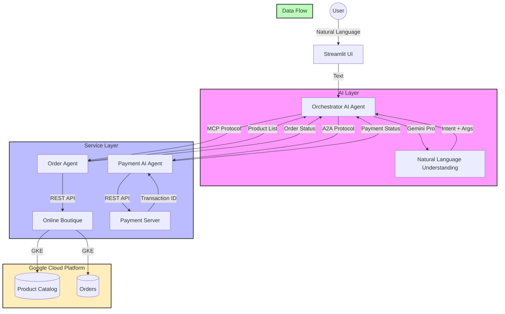

# TransactAI: Natural Language E-commerce with AI Agents 🛍️

A Google Cloud GKE Turns 10 Hackathon project that enables natural language product ordering using AI agents and Google's Online Boutique.

## 🌟 Features

- Natural language product ordering (e.g., "order 2 sunglasses")
- AI-powered order processing with Gemini Pro
- Integration with Google's Online Boutique e-commerce demo
- Agent-to-Agent (A2A) communication for payment processing
- Model Context Protocol (MCP) for service discovery
- Real-time order tracking and payment processing
- Beautiful Streamlit UI

## 🛠️ Architecture



### Component Details

- **Orchestrator AI Agent**: 
  - Built with Streamlit and Gemini Pro
  - Coordinates all services
  - Handles natural language processing
  - Manages user interactions

- **Order Agent (MCP Protocol)**:
  - Implements Model Context Protocol
  - Manages product catalog
  - Handles order placement
  - Integrates with Online Boutique

- **Payment AI Agent (A2A Protocol)**:
  - Implements Agent-to-Agent Protocol
  - Processes payment requests
  - Validates transaction details
  - Communicates with Payment Server

- **Payment Server**:
  - Simulates payment gateway
  - Generates transaction IDs
  - Validates payment details
  - Returns payment status

- **Online Boutique**:
  - Google's microservices demo
  - Runs on GKE
  - Manages product catalog
  - Handles order processing

## 🚀 Getting Started

### Prerequisites

1. Python 3.10+
2. Google Cloud SDK
3. kubectl
4. A Google Cloud project with billing enabled
5. Google AI (Gemini) API key

### Environment Setup

1. Clone the repository:
```bash
git clone [your-repo-url]
cd [repo-name]
```

2. Create and activate a virtual environment:
```bash
python -m venv triage_env
source triage_env/bin/activate  # On Windows: triage_env\Scripts\activate
```

3. Install dependencies:
```bash
pip install -r requirements.txt
```

4. Set up environment variables:
```bash
# Create .env file
echo "GOOGLE_API_KEY=your_api_key_here" > .env

# Create .env.boutique file
echo "BOUTIQUE_API_URL=http://your_boutique_ip" > .env.boutique
```

### Deploy Online Boutique

1. Run the setup script:
```bash
./setup_online_boutique.sh
```

2. Wait for the deployment to complete and note the external IP

3. Update `.env.boutique` with the external IP

### Start the Application

1. Start all services:
```bash
./start_services.sh
```

2. Open the Streamlit UI:
```bash
streamlit run orchestrator.py
```

## 🎯 Usage Examples

1. Show available products:
```
"show me what's available"
```

2. Order a product:
```
"I want to buy 2 sunglasses"
```

3. Check specific product:
```
"tell me about the hairdryer"
```

## 🔧 Technical Details

- **AI Models**: Google Gemini Pro for natural language understanding
- **Protocols**: 
  - A2A (Agent-to-Agent) for payment processing
  - MCP (Model Context Protocol) for service discovery
- **APIs**: 
  - Online Boutique REST API
  - FastAPI for microservices
  - Streamlit for UI

## 🏆 Hackathon Details

This project was created for the [GKE Turns 10 Hackathon](https://gketurns10.devpost.com/) on Devpost.

### Key Requirements Met:
1. Integration with Google's Online Boutique
2. Use of Google Cloud (GKE)
3. Implementation of AI/ML (Gemini)
4. Microservices architecture
5. Real-world application (e-commerce)

## 📝 License

MIT License - see LICENSE file

## 🙏 Acknowledgments

- Google Cloud Platform
- Google's Online Boutique demo
- Google Gemini AI
- Streamlit team
- FastAPI team
